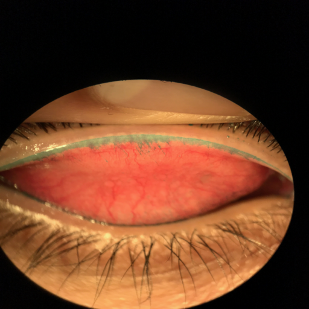

# Ocular-Image-Segmentation

- Developed and tested deep learning models for ocular image segmentation using TensorFlow and PyTorch, enhancing segmentation accuracy and speed.
- Developed desktop applications to facilitate the deployment and execution of these models, improving usability for medical professionals.

